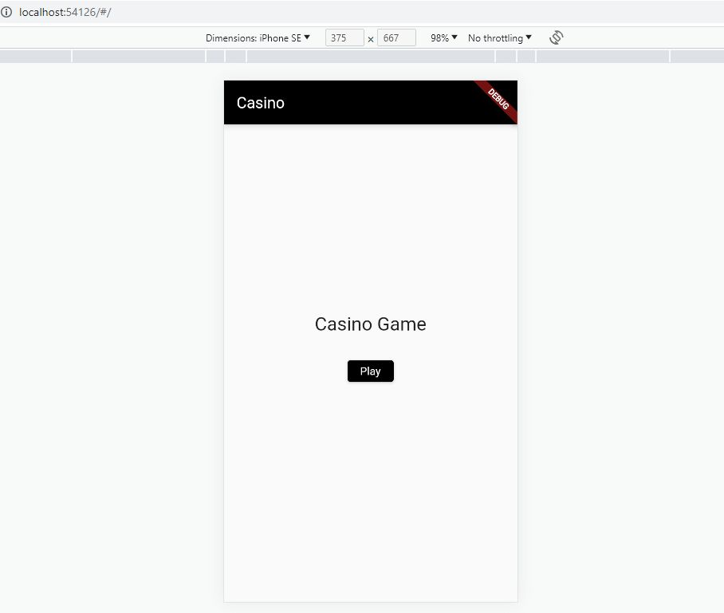
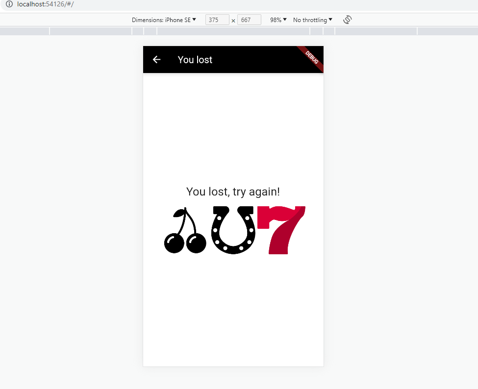
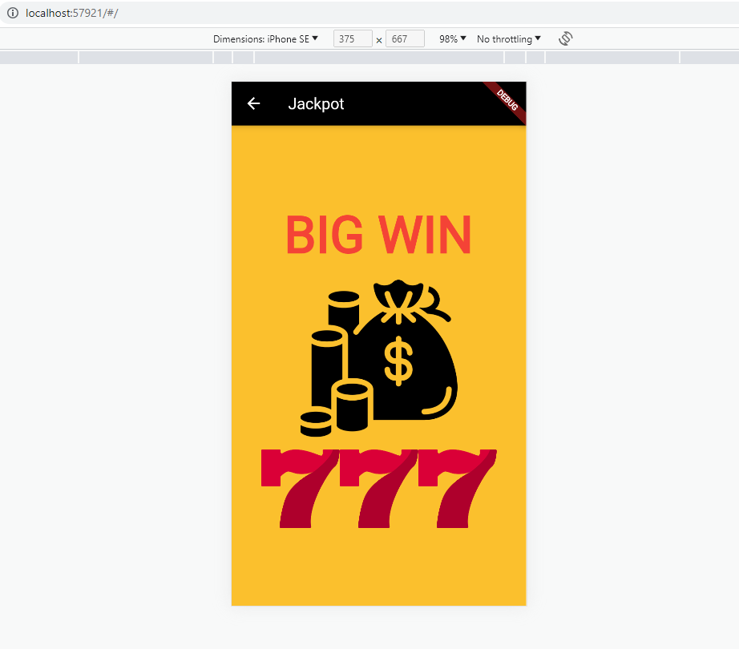
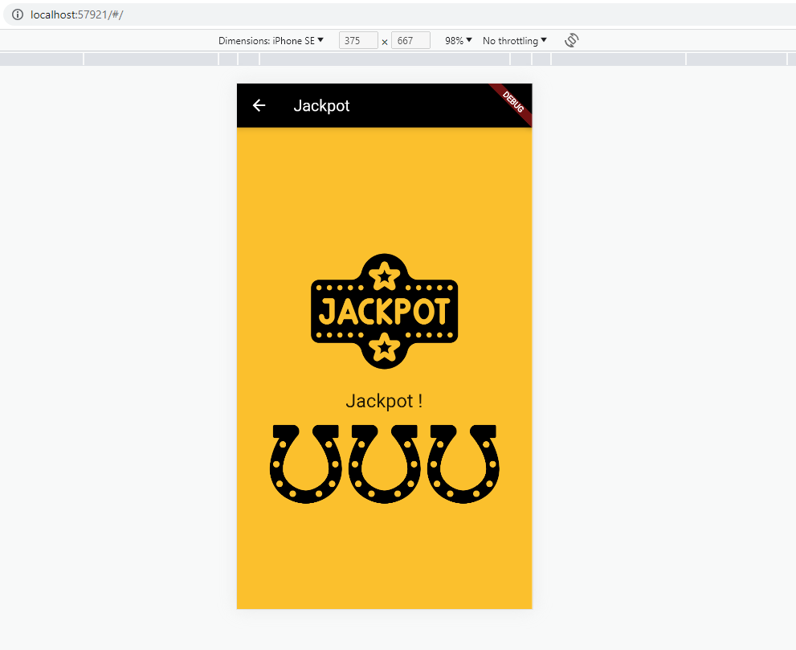

## Projet Casino - Flutter

## Réalisé par : [Hakima DJERMOUNI]

Ce projet a été réalisé dans le cadre d'un TP de conception et de programmation d'une application de casino fictif utilisant le framework Flutter.

## Description

L'application permet aux utilisateurs de jouer à un jeu de "Bandit Manchot". L'objectif est d'obtenir trois icônes identiques en les affichant de manière aléatoire. Si l'utilisateur réussit à obtenir les trois symboles identiques, le message "Jackpot" est affiché. Sinon, le message "You lost, try again!" est affiché. Un message ou une animation spécifique est également affiché si l'utilisateur réalise un Jackpot avec le symbole 7.

## Fonctionnalités

- Affichage aléatoire des icônes à chaque tentative.
- Vérification du résultat pour déterminer si l'utilisateur a obtenu un Jackpot ou non.
- Affichage d'un message spécifique avec Animation flash texte pour un Jackpot avec le symbole 7.

## Captures d'écrans:

<video src="Casino%20-%20Google%20Chrome%202023-06-30%2021-43-59.mp4" controls title="Title"></video>
## Prérequis

- Flutter SDK : [Installation de Flutter](https://flutter.dev/docs/get-started/install)

## Installation et exécution

2. Se rendre dans le répertoire du projet :
cd nom_du_projet

3. Exécuter l'application Flutter :
flutter run

## Tests

Le projet comprend également des tests de widgets pour vérifier l'interface utilisateur de l'application. Pour exécuter les tests, utilisez la commande suivante :
flutter test

